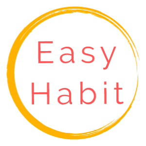

<!--
*** Thanks for checking out the Best-README-Template. If you have a suggestion
*** that would make this better, please fork the repo and create a pull request
*** or simply open an issue with the tag "enhancement".
*** Thanks again! Now go create something AMAZING! :D
-->

<!-- PROJECT SHIELDS -->
<!--
*** I'm using markdown "reference style" links for readability.
*** Reference links are enclosed in brackets [ ] instead of parentheses ( ).
*** See the bottom of this document for the declaration of the reference variables
*** for contributors-url, forks-url, etc. This is an optional, concise syntax you may use.
*** https://www.markdownguide.org/basic-syntax/#reference-style-links
-->
<!--[![Contributors][contributors-shield]][contributors-url]
[![Forks][forks-shield]][forks-url]
[![Stargazers][stars-shield]][stars-url]
[![Issues][issues-shield]][issues-url]
[![MIT License][license-shield]][license-url]-->
[![LinkedIn][linkedin-shield]][linkedin-url]

<!-- PROJECT LOGO -->
 

  
  <h3 align="center">Easy Habit</h3>

  

    Easy Habit app, built with React Native!
     
  

<!-- TABLE OF CONTENTS -->

  
Table of Contents

  <ol>
    <li>
      <a href="#about-the-project">About The Project</a>
      <ul>
        <li><a href="#built-with">Built With</a></li>
      </ul>
    </li>
    <li>
      <a href="#getting-started">Getting Started</a>
    </li>
    <li><a href="#license">License</a></li>
    <li><a href="#contact">Contact</a></li>
    <li><a href="#acknowledgements">Acknowledgements</a></li>
  </ol>

<!-- ABOUT THE PROJECT -->
## About The Project

This App is my first start to finish project build with React Native. Primary goals of this project is learning, improving and gaining knowledge. App purpose is very simple: create, edit, delete and overall track your daily habits, by simply marking your progress with simple click every day.

Main functionalities:
* Track daily habits. Create, edit, delete your own habits.
* Custom day tracking. E.g create a habit for mondays and thursdays only, streaks only include selected days.
* Database online, track your progress on any device.
* Registration complete with email, reset password easily.
* 3 different themes, 3 languages (EN, DK, LT)

App has no adds whatsoever and no plans to implement. The goal of this app is professional growth and improvement.

There are no in-app purchases or any limitations. It's completely free, and only thing appreciated is feedback and reviews.

### Built With

Technologies used in this project:
* [React Native](https://reactnative.dev/)
* [Expo](https://expo.io/)
* [AWS lambda](https://aws.amazon.com/lambda/)
* [Amplify](https://aws.amazon.com/amplify/)
* [AWS SES](https://aws.amazon.com/ses/)
* [MongoDB](https://www.mongodb.com/)
* [Mongoose](https://mongoosejs.com/)
* [Express.js](https://expressjs.com/)

<!-- GETTING STARTED -->
## Getting Started

1. Get App at Google Store [Easy Habit](https://play.google.com/store/apps/details?id=s.k.easyhabit)

<!-- LICENSE -->
## License

Distributed under the MIT License. See `LICENSE` for more information.

<!-- CONTACT -->
## Contact

Simonas Kralikas - patkppDev@gmail.com

Project Link: [https://github.com/foreverevey/Habits](https://github.com/foreverevey/Easy-Habit)

<!-- ACKNOWLEDGEMENTS -->
## Acknowledgements
* [Font Awesome](https://fontawesome.com)
* [React Native Modal Datetime Picker](https://github.com/mmazzarolo/react-native-modal-datetime-picker)
* [React Native Loading Spinner Overlay](https://github.com/joinspontaneous/react-native-loading-spinner-overlay)
* [React Native NetInfo](https://github.com/react-native-netinfo/react-native-netinfo)
* [React Native Collapsible](https://github.com/oblador/react-native-collapsible)
* [React Native Chart Kit](https://github.com/indiespirit/react-native-chart-kit)
* [React Native Calendars](https://github.com/wix/react-native-calendars)
* [React Native Swipe Gestures](https://github.com/glepur/react-native-swipe-gestures)
* [moment.js](https://momentjs.com/)

<!-- MARKDOWN LINKS & IMAGES -->
<!-- https://www.markdownguide.org/basic-syntax/#reference-style-links -->

[linkedin-shield]: https://img.shields.io/badge/-LinkedIn-black.svg?style=for-the-badge&logo=linkedin&colorB=555
[linkedin-url]: https://www.linkedin.com/in/simonas-kralikas-184717183/
